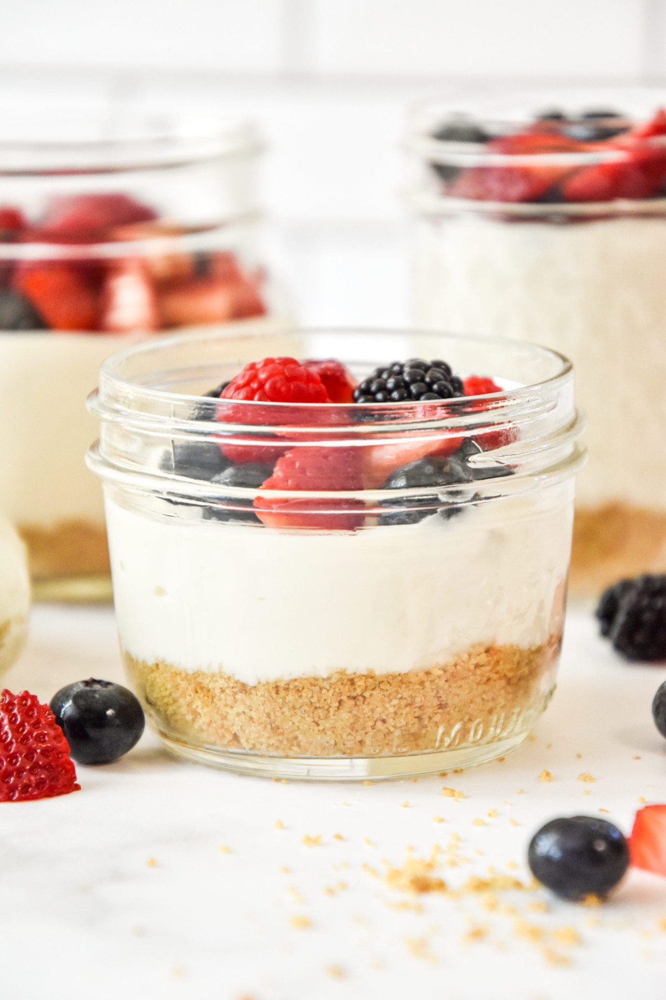
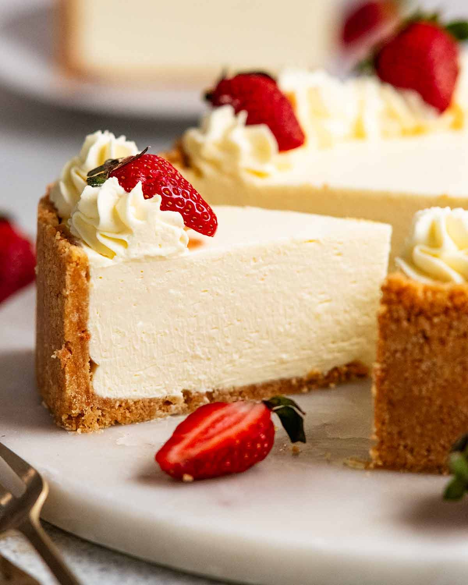
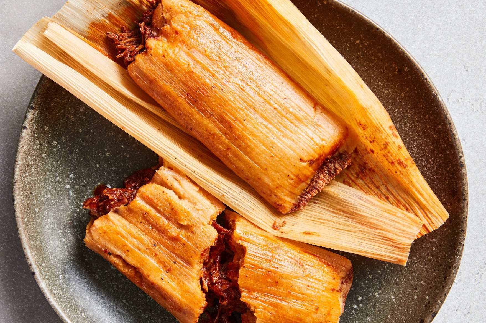
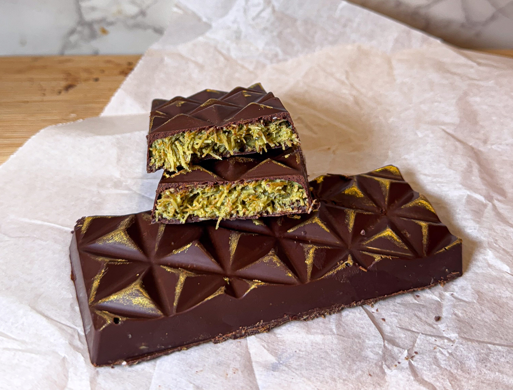

# HTML & CSS

## Elements of an HTML document

We have the following:
    - `<!doctype html>` - Required preamble.
    - `<html></html> - "Root Element", wraps all the content on page.
         - `<lang>` - <html> includes the `lang` attribute, setting primary language for the document.
    - `<head></head>`- Acts as a container for all the stuff you want to include on the HTML. Viewport, keystrokes, charsets, etc...
    - `<meta charset="utf-8">` - Sets the document character element to utf-8, the most universal text reader.
    - `<meta name="viewport" content="width=device-width">` - Prevents you from rendering a page too big for your screen.
    - `<title></title>` - Sets the page title.
    - `<body></body>` - Contains all the content they they would be looking for when they go to a website.

## Paragraphs & Lists

- Paragraphs are written between P-P.
    <ul>- Unordered List
        <li>milk</li>
        <li>sugar</li>
        <li>eggs</li>
    </ul>
    <ol>- Ordered List
        <li>1</li>
        <li>2</li>
        <li>3</li>
        <li>4</li>
    </ol>

 

## Creating Links

`<a>` element used to resemble "anchor".
    <a href="https://www.mozilla.org/en-US/about/manifesto/">
        Mozilla Manifesto
    </a>

## Order of operations

There is a way to use grid before your card modifiers
- They continued to be nested. Grid always goes on the outside of card.

<section class="menu">
  <h2>Menu</h2>
  

    <a href="#cakes" class="btn">Cakes</a>

    or

<section id="pastries">
  

    <article class="card"></article>
  

</section>

## HTML Attributes
 `rel` - Defines the relationship between a linked resource and the current document. 

 ## Removal code I am saving

   <!-- 
Cakes
 -->
  <!--- 
Cupcakes
 -->
   <!--- 
Cookies

    
Chocolate

    
Pastries

    
Other
-->

--------
<section class="fast-sellers">
    <h2>Fast Sellers</h2>

    

      <article class="card">
        
        <h3>Yogurt & Fruit Cups - Real mixed berries</h3>
        
$15.00

      </article>

      <article class="card">
        
        <h3>Multi-Flavor; No-Bake Cheesecake
          
$12.99

        </h3>
      </article>

      <article class="card">
        
        <h3>Traditional Tamales - Beef or Chicken
          
$19.99

        </h3>
      </article>

      <article class="card">
        
        <h3>Rich and flaky Dubai Chocolate - Pistaccio flavored
          
$30.00

        </h3>
      </article>

    

</section>
------